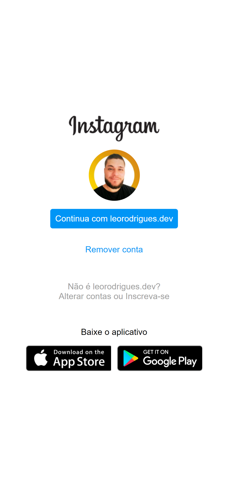

<p align="center" >

</p>


<h1 align="center">
     Instagram login page
</h1>
<p align="center">🆙 Page created in Bootcamp HTML Web Developer Challenge </p>


\
\
[](https://github.com/)
[](https://code.visualstudio.com/)
[](https://github.com/ellerbrock/open-source-badges/)

<a href="https://developer.mozilla.org/pt-BR/docs/Web/HTML/"></a>
<a href="https://developer.mozilla.org/pt-BR/docs/Web/CSS"></a>
<a href="https://github.com/leorodriguesdev/LPInstagram/issues"></a>
<a href="https://github.com/leorodriguesdev/LPInstagram/network"></a>
<a href="https://github.com/leorodriguesdev/LPInstagram/stargazers"></a>

Guide
=================
<!--ts-->
   * [About](#About)
   * [Project Status](#Project-Status)
   * [Features](#Features)
   * [Prerequisites](#Prerequisites)
   * [Running the application](#Running-the-application)
   * [Technologies](#Technologies)
   * [Author](#Author)
<!--te-->

## About

In this project we have the challenge of rebuilding the Instagram login page. For this, it is recommended the use of CSS with Flexbox, one of the most used element positioning approaches when it comes to responsiveness.


## Project Status


<h4 align="center"> 
	 ✅   Instagram login page 🚩 Concluded  ✅
</h4>

## Features


- [x] Image Phone
- [x] Login Area
- [ ] Animation on Phone as on the original page

---
<p align="center" >

</p>


## Prerequisites

Before starting, you will need to have the following tools installed on your machine:
[Git](https://git-scm.com). 
Besides, it's nice to have an editor to work with code like [VSCode](https://code.visualstudio.com/)

## 🎲 Running the application

```bash
# Clone this repository
$ git clone https://github.com/leorodriguesdev/LPInstagram.git

# Access the project folder in the terminal/cmd
$ cd LPInstagram

# Now you just need to open the index.html file that will be directed to your usual browser

```
## 🛠 Technologies

The following tools were used in the construction of the project:

- [HTML](https://developer.mozilla.org/pt-BR/docs/Web/HTML/)
- [CSS](https://developer.mozilla.org/pt-BR/docs/Web/CSS)
  - [Flexbox](https://developer.mozilla.org/pt-BR/docs/Learn/CSS/CSS_layout/Flexbox)


## Author


<a href="https://bio.link/leorodriguesdev">
 
 <br />
 <sub><b>Leonardo Rodrigues</b></sub></a> <a href="https://bio.link/leorodriguesdev" title="link leo">⚡</a>


Made with ❤️ by Leonardo Rodrigues 👋🏽 Contact us!

[](https://twitter.com/leorodriguesdev) [](https://www.linkedin.com/in/on-leorodrigues/) 
[](mailto:leorodriguesoffice@gmail.com)
<p align="left" >

</p>