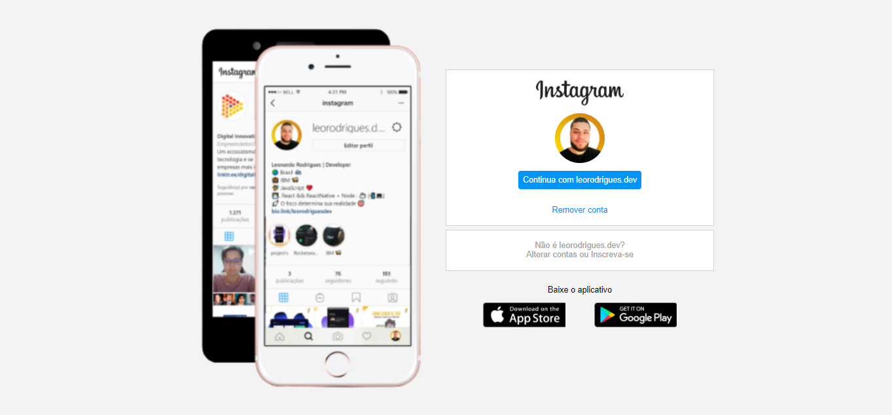
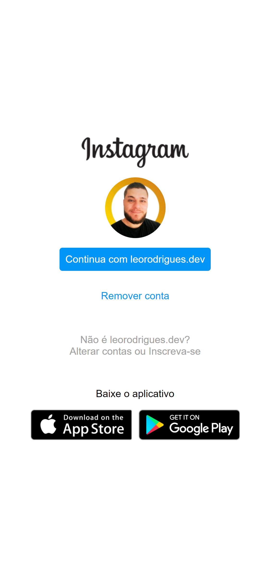
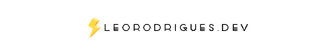

<a alt="README in english language" href="/README-en.md">Click here for README in english language <span>&nbsp;&nbsp; ' </span></a>

<p align="center" >

</p>


<h1 align="center">
     Página de login do Instagram
</h1>
<p align="center">🆙 Página criada no desafio Bootcamp HTML Web Developer </p>


\
\
[](https://github.com/)
[](https://code.visualstudio.com/)
[](https://github.com/ellerbrock/open-source-badges/)

<a href="https://developer.mozilla.org/pt-BR/docs/Web/HTML/"></a>
<a href="https://developer.mozilla.org/pt-BR/docs/Web/CSS"></a>
<a href="https://github.com/leorodriguesdev/LPInstagram/issues"></a>
<a href="https://github.com/leorodriguesdev/LPInstagram/network"></a>
<a href="https://github.com/leorodriguesdev/LPInstagram/stargazers"></a>

Guia
=================
<!--ts-->
   * [Sobre](#Sobre)
   * [Status do Projeto](#Status-do-projeto)
   * [Features](#Features)
   * [Pré-requisitos](#Pre-requisitos)
   * [Rodando a aplicação](#Rodando-a-aplicação)
   * [Tecnologias](#Tecnologias)
   * [Autor](#Autor)
<!--te-->

## Sobre

Nesse projeto temos o desafio de reconstruir a página de login do Instagram. Para isso, é recomendado o uso de CSS com Flexbox, uma das abordagens de posicionamento de elementos mais utilizadas quando se trata de responsividade.

## Status do Projeto

<h4 align="center"> 
	 ✅   Página de login do Instagram 🚩 Concluído  ✅
</h4>

## Features


- [x] Imagem Phone
- [x] Área de Login
- [ ] Animação no Phone como na página original

---

<p align="center" >

</p>


## Pré-requisitos

Antes de começar, você vai precisar ter instalado em sua máquina a seguinte ferramenta:
[Git](https://git-scm.com).
Além disto é bom ter um editor para trabalhar com o código como [VSCode](https://code.visualstudio.com/)

## 🎲 Rodando a aplicação

```bash
# Clone este repositório
$ git clone https://github.com/leorodriguesdev/LPInstagram.git

# Acesse a pasta do projeto no terminal/cmd
$ cd LPInstagram

# Agora basta você abrir o arquivo index.html que será direcionado ao seu navegador de costume

```
## 🛠 Tecnologias

As seguintes ferramentas foram usadas na construção do projeto:

- [HTML](https://developer.mozilla.org/pt-BR/docs/Web/HTML/)
- [CSS](https://developer.mozilla.org/pt-BR/docs/Web/CSS)
  - [Flexbox](https://developer.mozilla.org/pt-BR/docs/Learn/CSS/CSS_layout/Flexbox)


## Autor


<a href="https://bio.link/leorodriguesdev">
 
 <br />
 <sub><b>Leonardo Rodrigues</b></sub></a> <a href="https://bio.link/leorodriguesdev" title="link leo">⚡</a>


Feito com ❤️ por Leonardo Rodrigues 👋🏽 Entre em contato!

[](https://twitter.com/leorodriguesdev) [](https://www.linkedin.com/in/on-leorodrigues/) 
[](mailto:leorodriguesoffice@gmail.com)

<p align="left" >

</p>